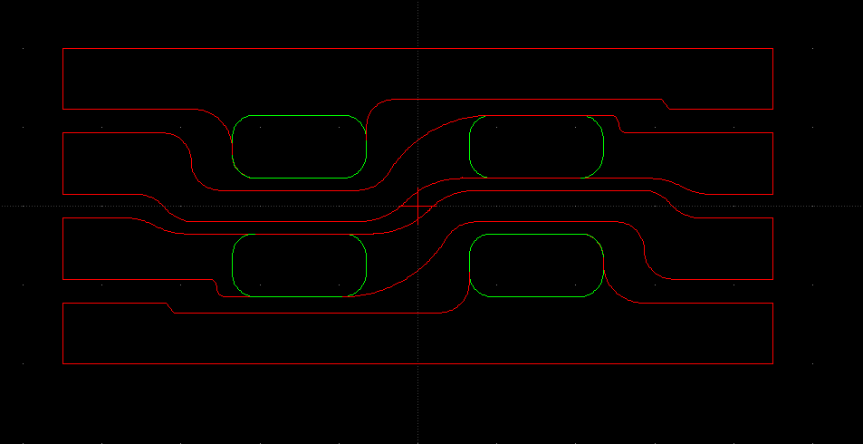

# dxf2kicad_mod
Create a KiCad footprint from a DXF file

For example, from

:

generate a footprint:


## How it works
It will read the DXF file and:

- converts arcs to lines
- find arcs and lines which compose a closed-loop graphic and output a polygon
- lines which do not form a closed polygon are output as lines

## Layers

Each layer is handled seperately, the layer name is converted to a layer name in the KiCad footprint file.

## Samples

See `tests` for some examples.

## Limitations
* Supports LINE, ARC, POLYLINE and LWPOLYLINE
* each line must connect with another line or arc's beginning or end point to within 0.025mm
* if there are lines with coincident end points, the algorithm may fail to identify polygons correctly

## How to use
### Install Python 3.9

See https://www.python.org/downloads/.

### Install ezdxf

`> pip install ezdxf`

### Get a copy of dxf2kicad_mod

```
> git clone https://github.com/bobc/dxf2kicad_mod.git
> cd dxf2kicad_mod
```

### Create a DXF file

Use your favorite CAD to tool to create a DXF file

### Generate KiCad footprint

Use following command line to generate footprint

`> python dxf2kicad_mod.py <dxf_file_name> <footprint_file.kicad_mod>`

### Add to KiCad

Add the folder containing the footprint to KiCad's Footprint Library Table.
